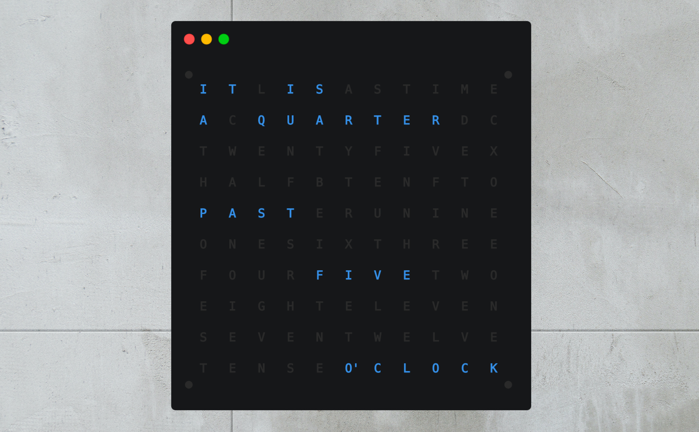

tty-qlock
=========

A minimal, curses-based clock, for your terminal. Inspired by the [QlockTwo by Biegert&Funk](https://qlocktwo.com/us/ "QlockTwo by Biegert&Funk").

Setup
-----

### Install
    # make install

### Uninstall
    # make uninstall

Notes
-----

### Dependencies
*   python-curses

